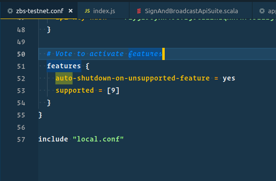

# Zbs [](https://travis-ci.org/0bsnetwork/Zbs)


In the master branch there is a code with functions that is under development. The latest release for each network can be found in the [Releases section](https://github.com/0bsnetwork/Zbs/releases), you can switch to the corresponding tag and build the application.


# Instructions for Running

Download the zbs-testnet.conf file from this directory and modify it according to the comments present in the file itself (if unsure about what you are doing, it is sufficient to only change the Node name and wallet password, you can leave all else as it is).

Download the appropriate file from the [Releases section](https://github.com/0bsnetwork/Zbs/releases):
If you are running a Debian-based GNU/Linux system (including Ubuntu or Linux Mint) and want to run the node as a service, download the latest version of the file with the name ending in all.deb and follow the instructions for Option 1 below.
If you are running any other OS, or want to run the node only temporarily, download the latest version of the file with the name ending in .jar and follow the instructions for Option 2 below.


Option 1: Install as a service on Ubuntu / Debian:

```
sudo dpkg -i zbs_0.*_all.deb
```

Start the service (it will in the future run automatically on boot):
```
systemctl start zbs.service
```

Monitor the service:
```
journalctl -u zbs.service -f
```


Option 2: Run as a Java file

```
java -jar zbs-all-0.*.jar zbs-testnet.conf
```

# Feature Voting

To vote for a feature, add the feature number into your config file as below; 



Mutiple features can be seperated by commas; 

```
features = [9,10,11]
```

Note: Features < 9 have been pre-activated on this current node version. 

# Tests & Coverage

```
 sbt -J-XX:MaxMetaspaceSize=512M -J-XX:MetaspaceSize=512M -J-Xms2048M -J-Xmx2048M -J-Xss6M -J-XX:MaxPermSize=512M ";coverage;checkPR;coverageReport"
```
